# Pulsar Model Visualizar UML Diagrams
## クラス図
### 基本設計
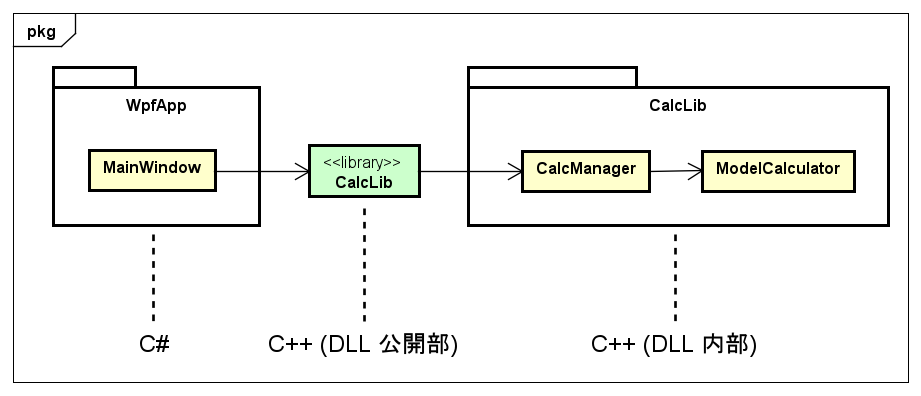

### 全体
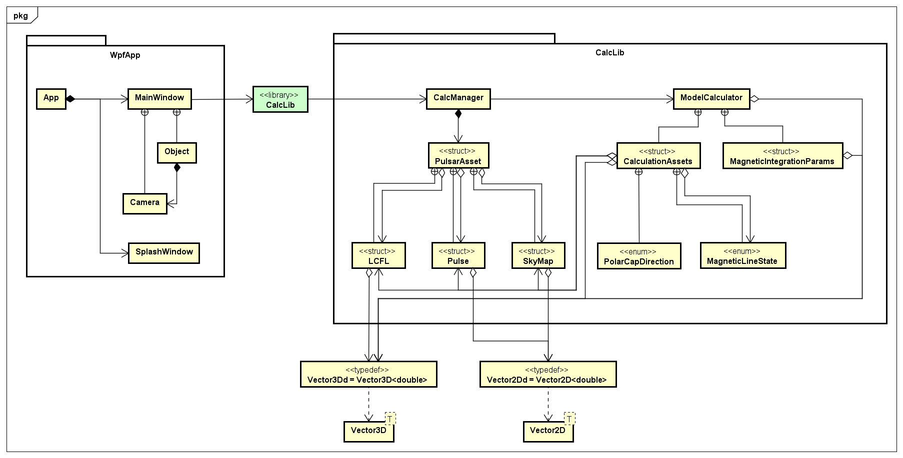

### WpfApp
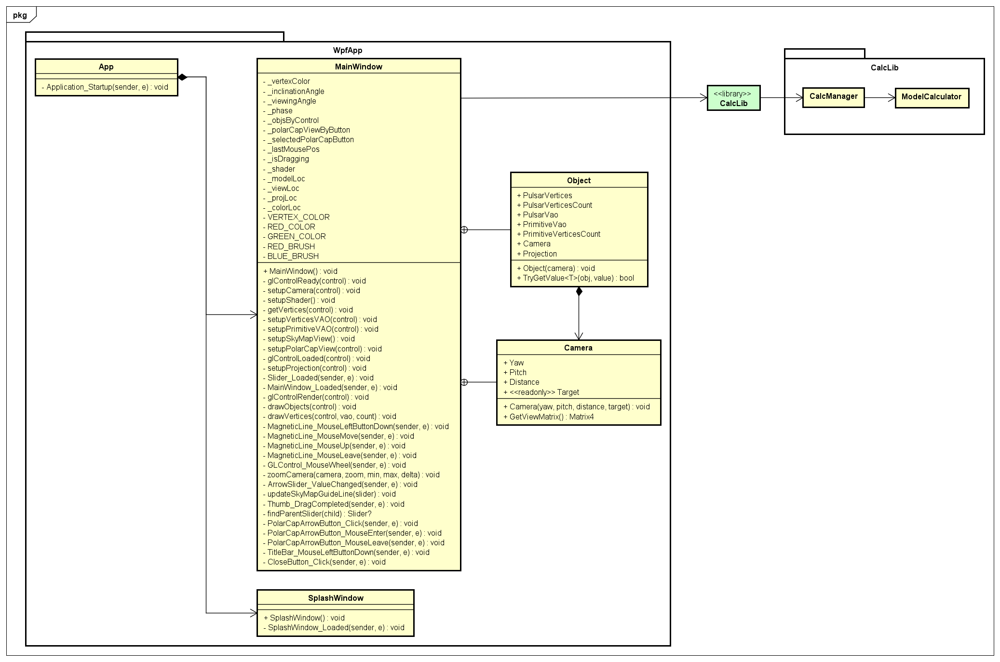

### CalcLib
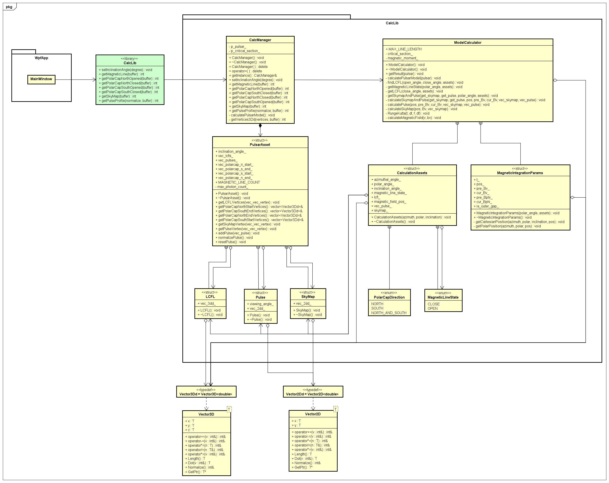

## アクティビティ図
### メイン画面起動〜描画
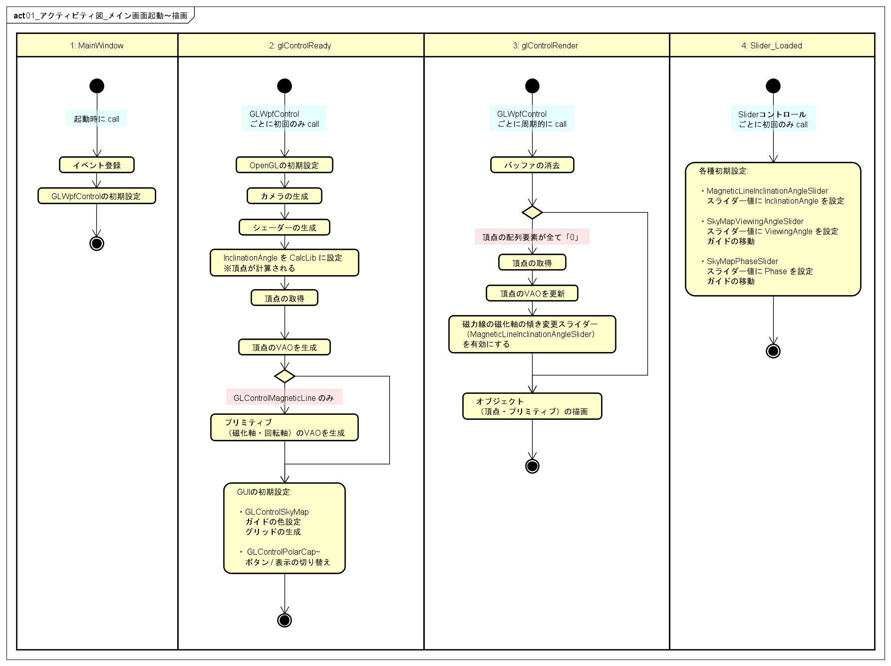

### MagneticLine
#### View 操作

#### Slider 操作
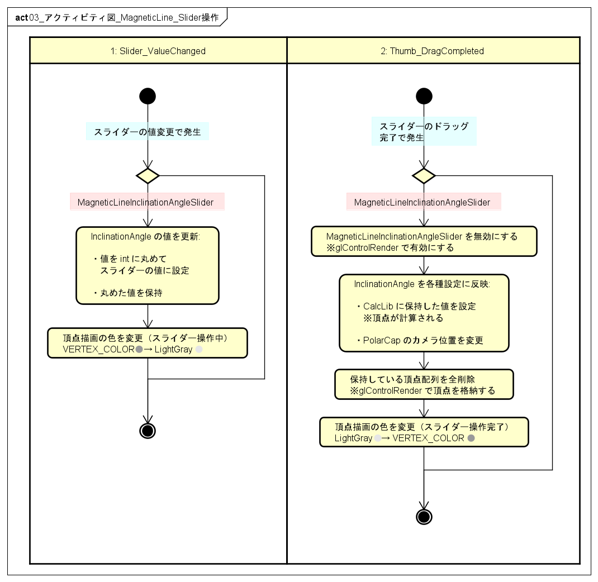

### PolarCap
#### View 操作
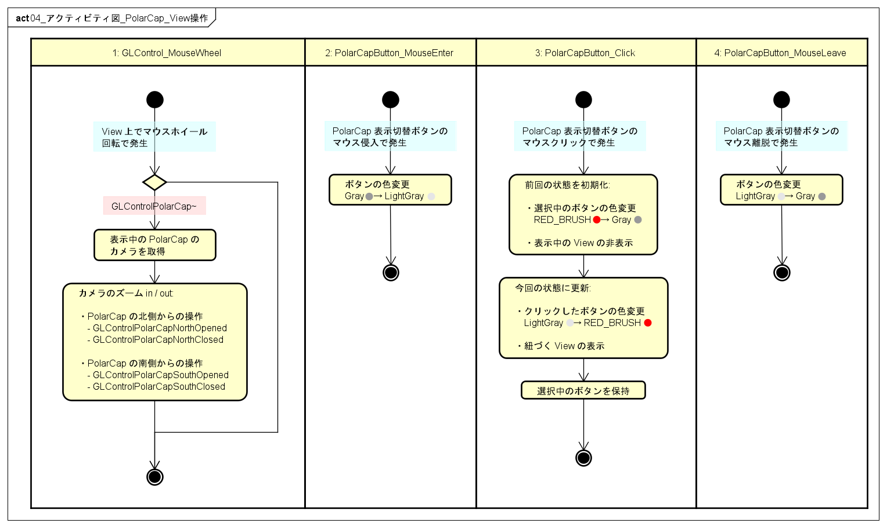

### SkyMap
#### Slider 操作
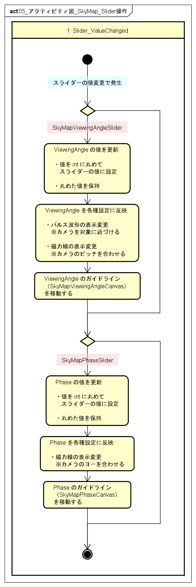

### PulseProfile
#### View 操作
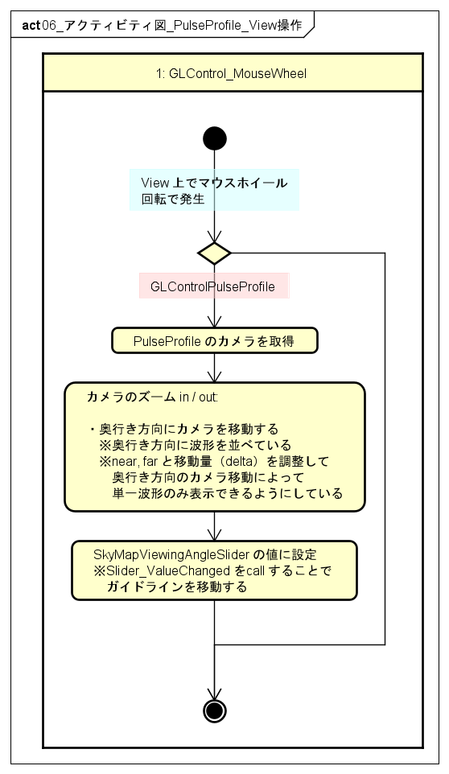

## シーケンス図
### CalcLib
#### Inclination Angle の設定
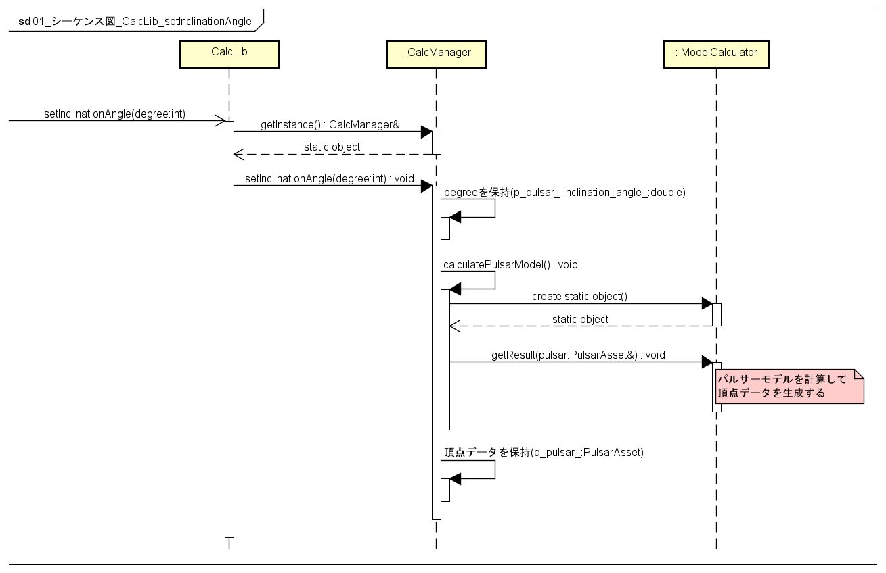

#### 計算結果の取得
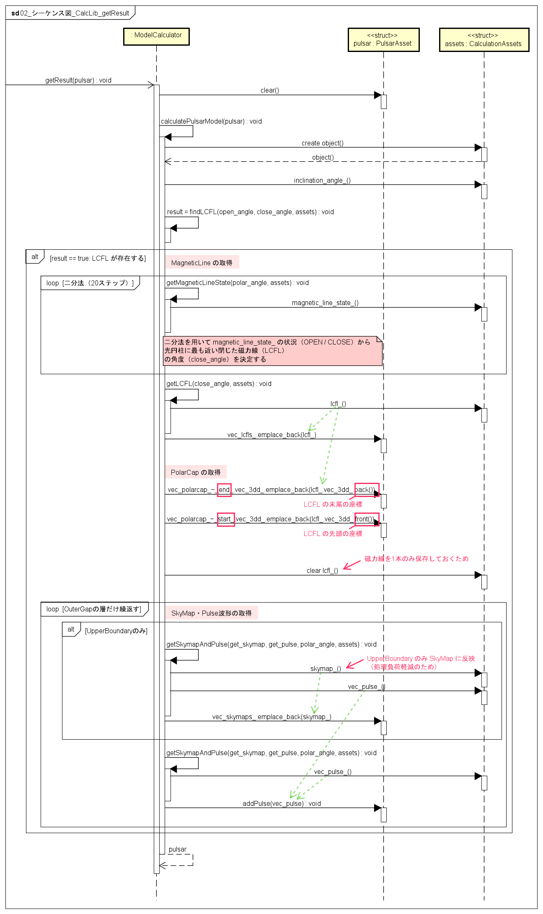