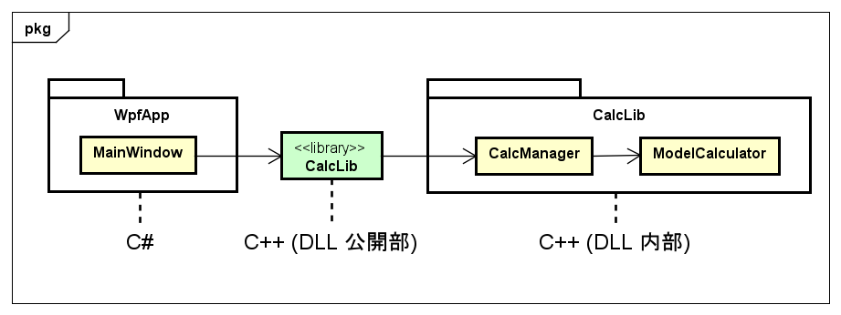
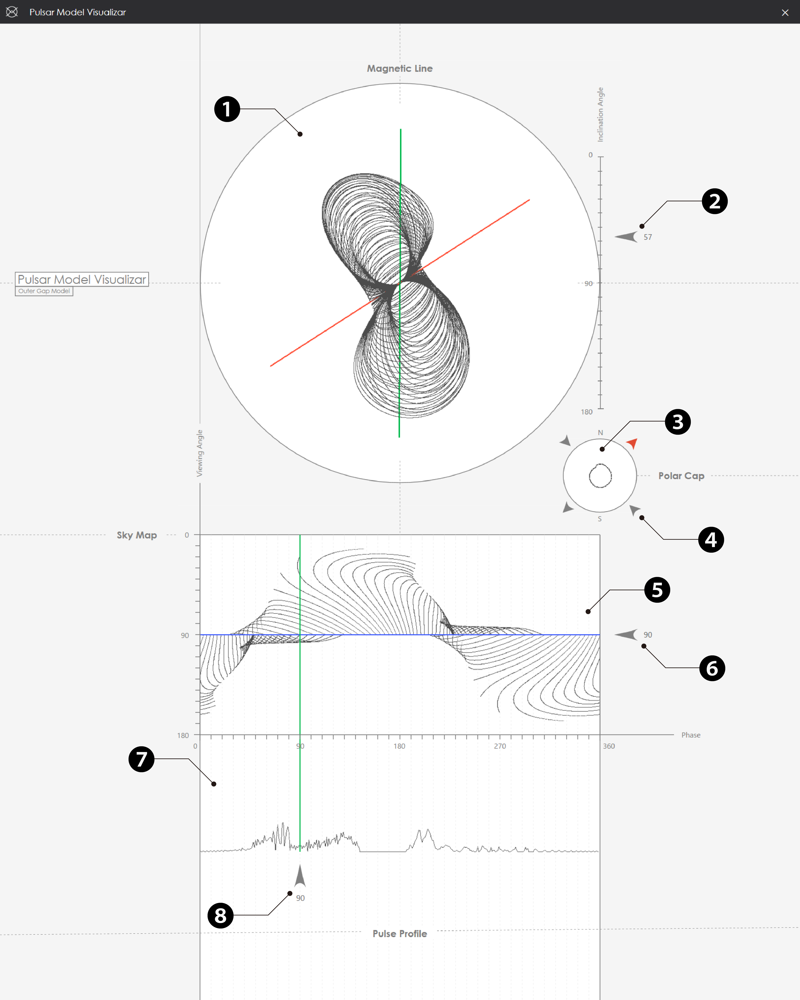

# Pulsar Model Visualizar
## 概要
このアプリケーションは、パルサーという星の放射モデルを可視化するために制作しました。
パルサーの磁力線や観測されるパルス波形などを算出します。
表示部分は C# を用いて OpenTK による3Dレンダリング処理を実装し、計算部分は C++ で実装しています。
マウス操作によるカメラ移動や、GUI操作によるパラメータ変更などができます。


### 開発背景
このアプリケーションは、大学院での研究内容を再現するために個人開発したものです。
当時は計算部分を Fortran で実装し、その結果を gnuplot を用いて可視化していました。
しかし将来的に、表示部分を実装することでより直感的に計算結果を眺められるようにしたいという思いがありました。
そこで、5年ほど前から少しずつ開発を行ってきました。


## 開発環境
* [開発言語]　C#, C++
* [構成]
  * C#
    * WPF（GUI構築）
    * OpenTK（3D描画）
  * C++ 
    * Native DLL（数値計算）
* [OS]　Windows 11
* [IDE]　Visual Studio 2022
* [CPU]　Intel Core i9
* [GPU]　NVIDIA GeForce RTX 4060 Ti
* [RAM]　32GB
* [OpenGL]　4.6


## ディレクトリ構成
```
PulsarModelVisualizar/
 ├─ dev/
 │   ├─ build/
 │   │   └─ x64/
 │   │        ├─ Release/
 │   │        │   ├─ WpfApp.exe       # 実行ファイル
 │   │        │   ├─ CalcLib.dll      # Native DLL
 │   │        │   └─ その他依存 DLL
 │   │        └─ Debug/
 │   ├─ WpfApp/                       # GUI部ソースコード（C#）
 │   ├─ CalcLib/                      # DLL部ソースコード（C++）
 │   └─ PulsarModelVisualizar.sln     # Visual Studio ソリューションファイル
 ├─ doc/
 │   ├─ images/
 │   │   ├─ uml/                      # UML図
 │   │   └─ demo.gif                  # 操作デモ動画
 │   └─ PulsarModelVisualizar.asta    # 設計ファイル
 ├─ DESIGN.md                         # UML図一覧
 └─ README.md
```


## 実行方法
### 実行ファイルから
1. `WpfApp.exe` を実行

### Visual Studio から
1. Visual Studio 2022 を起動
2. `PulsarModelVisualizar.sln` を開く
3. ソリューション構成を **Debug/Release** に設定
4. プラットフォームを **x64** に設定
5. **ソリューションのビルド**を実行（Ctrl + Shift + B）
6. **WpfApp** をスタートアッププロジェクトに設定して実行（F5）


## 基本設計
設計の詳細は [DESIGN.md](DESIGN.md) を参照ください。




* WpfApp : 表示部分のモジュール（C#）
* CalcLib : 計算部分のモジュール（C++）

### クラス構成


* WpfApp
  * App : アプリケーションのエントリポイント
  * SplashWindow : WPF を用いたスプラッシュ画面
  * MainWindow : WPF を用いたメイン画面、OpenTK による3D描画を行う
    * Camera : カメラ設定を保持する
    * Object : 頂点データなど、描画情報を保持する
* CalcLib
  * CalcManager : 計算結果を返すなど、計算処理を管理する
  * PulsarAsset : パルサーの各種データ
    * LCFL : 放射領域を定義する磁力線（LastClosedFieldLine）の点群データ
    * Pulse : 放射により観測されるパルス波形の点群データ
    * SkyMap : 放射の位相マッピングの点群データ
  * ModelCalculator : モデル計算を行う
    * CalculationAssets : モデル計算に必要なデータ
      * PolarCapDirection : 磁力線の描画始点の方角
      * MagneticLineState : 磁力線の開閉状況
    * MagneticIntegrationParams : 磁場の積分計算に必要なパラメータ
* Vector3D\<T> : 3次元ベクトルのクラステンプレート
* Vector2D\<T> : 2次元ベクトルのクラステンプレート


## 画面仕様


| No. | 名称 | 機能 |
|:---|:---|:---|
| &#10102; | Magnetic Line ビュー | ・ 磁力線、磁化軸（赤）、回転軸（緑）を表示<br>・ マウスドラッグで視線方向の傾き、視線方向の回転を変更<br>・ ダブルクリックで初期位置に戻る<br> | 
| &#10103; | Inclination Angle スライダー | ・ 磁化軸の傾きを変更<br>・ 変更中は頂点描画がグレーアウト |
| &#10104; | Polar Cap ビュー | ・ 磁力線の始点 / 終点を表示<br>・ 縦スクロールでズームイン / アウト |
| &#10105; | Polar Cap 表示切り替えボタン | ・ 表示（赤）/ 非表示（灰）を切り替える<br>　 　Ｎ極側の始点<br>　 　Ｓ極側の始点<br>　 　Ｎ極側の終点<br>　 　Ｓ極側の終点<br> |
| &#10106; | Sky Map ビュー | ・ 放射の位相マッピングを表示 |
| &#10107; | Viewing Angle スライダー | ・ 視線方向の傾きを変更 |
| &#10108; | Pulse Profile ビュー | ・ 視線方向から観測されるパルス波形を表示<br> ・ 縦スクロールで視線方向の傾きを変更 |
| &#10109; | Phase スライダー | ・ パルス波形の位相を変更<br>・ 視線方向の回転を変更 |


## 機能仕様
| 機能 | 概要 | モジュール | 対象ビュー |
|:---|:---|:---|:---|
| 頂点の計算 | Inclination Angle の入力で頂点を計算 | CalcLib | - |
| 頂点の描画 | 計算結果を取得して頂点を描画 | WpfApp | - |
| カメラ操作 | マウス操作で視点を移動、回転 | WpfApp | Magnetic Line<br>Polar Cap<br>Pulse Profile |
| パラメータ変更 | スライダー操作で値を変更 | WpfApp | Magnetic Line<br>Polar Cap<br>Sky Map<br>Pulse Profile |
| 表示切り替え | ボタン操作で表示 / 非表示を切り替え | WpfApp | Polar Cap |

### 処理の流れ
1. アプリケーション起動とともに、スプラッシュ画面を表示
2. メイン画面で頂点を計算して描画処理を実行<br>
・メイン画面から CalcLib に Inclination Angle を入力<br>
・CalcLib で算出された点群データをメイン画面が取得<br>
・OpenTK による描画処理を実行<br>
3. メイン画面を表示し、スプラッシュ画面を閉じる
4. ユーザ操作に応じて点群データを再計算、再描画


## 工夫した点
1. **操作性向上のためのアーキテクチャ設計**<br>
もともとは、freeglut を用いて C++/CLI での実装から始めました。しかし、より直感的なユーザ操作を実現するため、表示部分は拡張性の高い C#（WPF）を採用し、OpenTK を用いた実装に変更しました。計算部分は既存コードの再利用と処理の高速化のため、C++ のライブラリとして実装しました。

2. **パラメータの影響範囲を表すUI設計**<br>
例えば、パラメータの Viewing Angle を変更すると、Pulse Profile ビューの波形と Magnetic Line ビューのカメラ位置が変更されます。このように、挙動を連動させることでパラメータの影響範囲を表し、パラメータの意味を視覚的に示しました。


## 今後の展望
1. **開発環境に依存しないアーキテクチャへ展開**<br>
継続して開発を行うために、開発環境の依存を減らしたいと考えています。そのため、Visual Studio を用いた開発から CMake への移行を検討しています。

2. **観測データとの比較機能の追加**<br>
採用した放射モデルの再現性を検証するために、計算したパルス波形を実際の観測結果と比較できる機能の追加を検討しています。