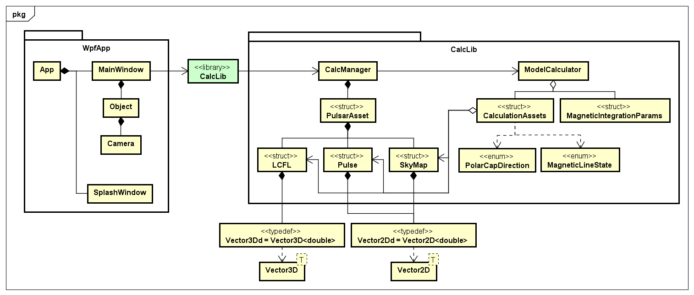

# Pulsar Model Visualizar
パルサーという星の理論モデルを可視化するためのアプリケーションです。<br>
磁化軸の傾き、観測者の視線方向、自転位相からパルス波形を計算し、描画しています。<br>
各パラメータが波形に与える影響を視覚的に理解できるようなUIを目指しました。<br>


## 動作環境
- Windows 11
- Visual Studio 2022
- OpenGL 3.1以上

 
## 使用ライブラリ
- OpenTK 4.9.4


## フレームワーク
-  .NET 8.0
-  WPF


## 設計




[詳細はこちら](docs/DESIGN.md)


## ディレクトリ構成
```
PulsarModelVisualizar/
 ├─ dev/
 │   ├─ CalcLib/                        # DLL部ソースコード（C++）
 │   ├─ WpfApp/                         # GUI部ソースコード（C#）
 │   └─ PulsarModelVisualizar.sln       # Visual Studio ソリューションファイル
 ├─ docs/
 │   ├─ images/
 │   │   ├─ material/                   # 画像素材
 │   │   └─ uml/                        # 各種UML図
 │   ├─ videos/
 │   │   └─  PulsarModelVisualizar.mp4  # デモ動画
 │   ├─ DESIGN.md                       # UML図一覧
 │   └─ PulsarModelVisualizar.asta      # astah 設計ファイル
 ├─ PulsarModelVisualizar.zip           # 実行ファイル一式
 └─ README.md                           # プロジェクト概要
```


## 実行方法
1. `PulsarModelVisualizar.zip` をダウンロード
2. ZIPファイルを解凍
3. `PulsarModelVisualizar.exe` を実行<br>
※ Windows Defender SmartScreen が表示されたときは **[詳細情報] → [実行]** を選択


## 操作方法


| No. | マウス | 操作 |
|:---|:---|:---|
| &#10102; | ドラッグ | 視線方向、自転位相の変更 | 
| &#10103; | ドラッグ | 磁化軸の傾きを変更 |
| &#10104; | 縦スクロール | 磁極の磁力線をズームイン・アウト |
| &#10105; | ワンクリック | 磁力線の始点・終点を切り替え |
| &#10106; | ドラッグ | 視線方向を変更 |
| &#10107; | 縦スクロール | 視線方向を変更 |
| &#10108; | ドラッグ | 自転位相を変更 |


## 機能
### 描画
- 磁化軸の傾きから磁力線を計算（Magnetic Line - Last Closed Field Line(LCFL)）
- 磁化軸の傾き、視線方向、自転位相からマッピングを計算（Sky Map）
- マッピングからパルス波形を計算（Pulse Profile）

### 操作・カメラ
- マウス操作による視点変更
- スライダーによるパラメータ変更
- ボタンによる表示切り替え

## 参考文献
- 『パルサーの理論的なパルスプロファイルの研究』（本人 著, 2015年）