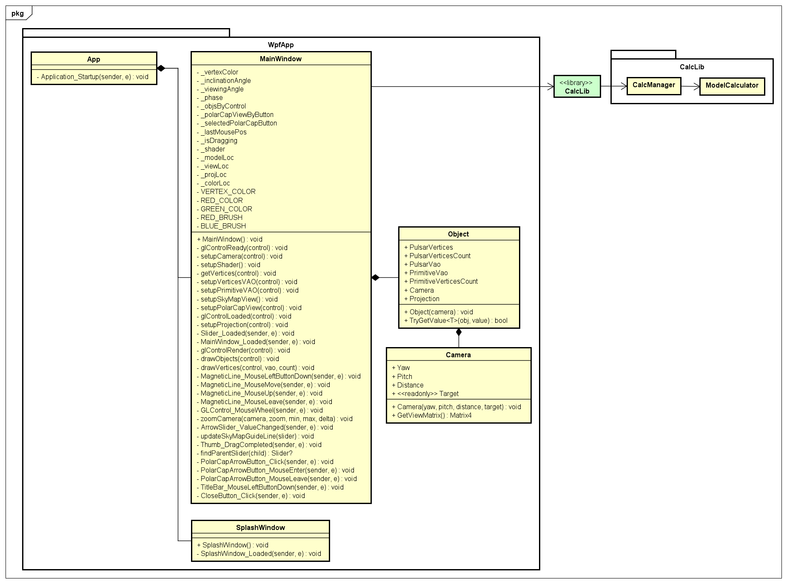
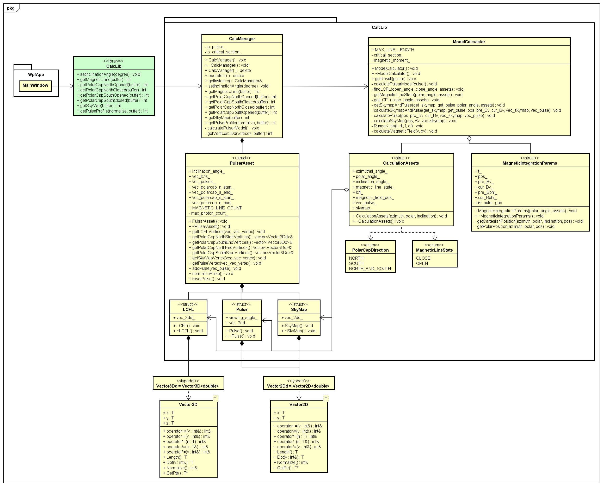
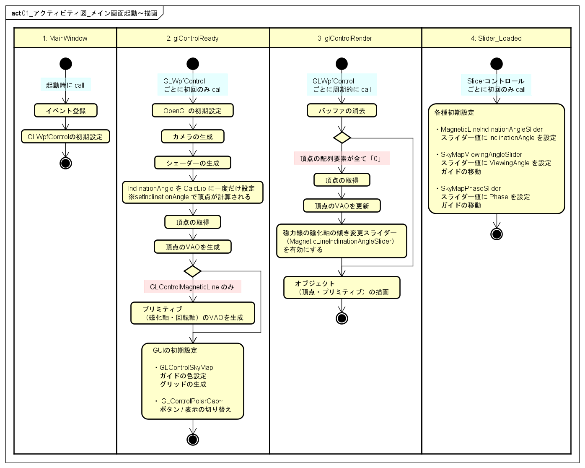
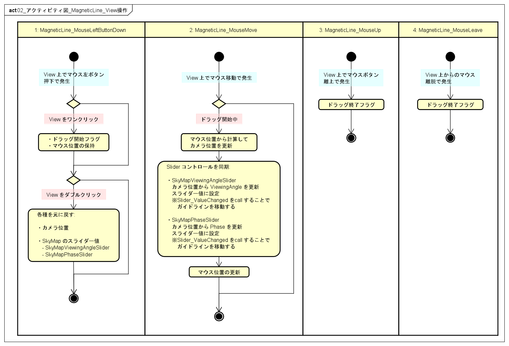
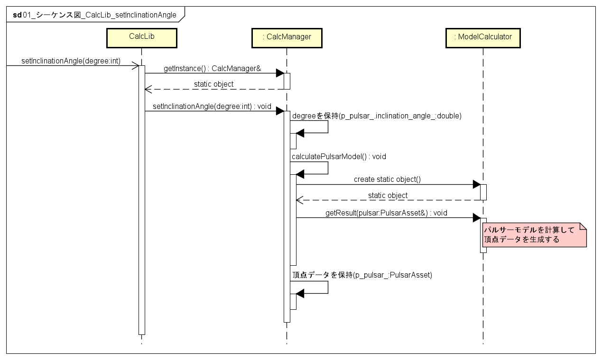

# Pulsar Model Visualizar UML Diagrams
## クラス図
### 基本設計

### 全体

### WpfApp

### CalcLib

## アクティビティ図
### メイン画面起動〜描画

### MagneticLine
#### View 操作

#### Slider 操作

### PolarCap
#### View 操作

### SkyMap
#### Slider 操作

### PulseProfile
#### View 操作

## シーケンス図
### CalcLib
#### Inclination Angle の設定と頂点データの生成

#### 頂点データの生成
